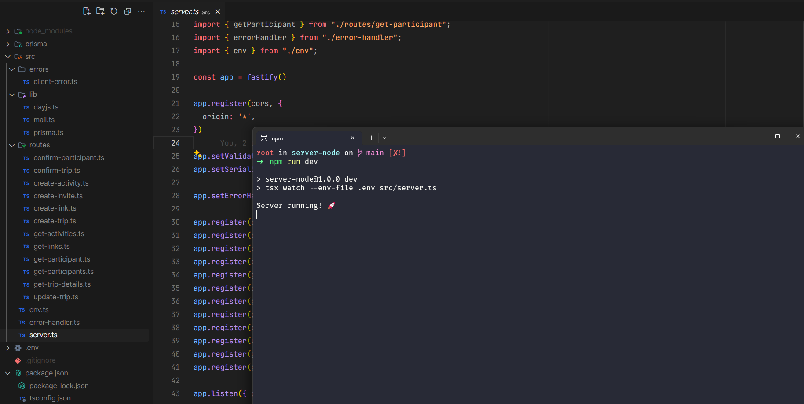

<h1 align="center">Plann.er</h1>

  

## ✨ Tecnologias

Esse projeto foi desenvolvido com as seguintes tecnologias:

- [Node.js](https://nodejs.org/en/)
- [Typescript](https://www.typescriptlang.org/)
- [Fastify](https://fastify.dev/)
- [Prisma](https://www.prisma.io/)
- [Nodemailer](https://nodemailer.com/)

## 💻 Projeto

Plann.er é uma uma aplicação de planejamento de viagens que permite convidar os amigos que participarão da viagem.

## 🚀 Como executar

- Clone o repositório
- Rode `npm i` para baixar as dependências
- Rode `npx prisma migrate deploy` para criar as tabelas do banco de dados.
- Rode o `npm run dev` para iniciar a aplicação.

Por fim, o back-end estará disponível em `http://localhost:3333`

## 📄 Licença

Esse projeto está sob a licença MIT. Veja o arquivo [LICENSE](LICENSE.md) para mais detalhes.
